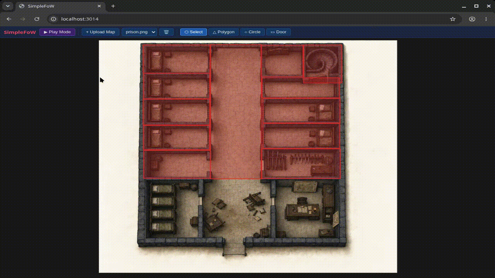
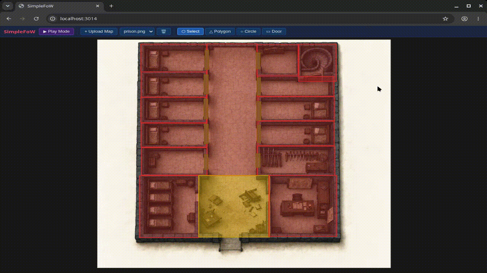

# SimpleFoW

A lightweight, browser-based **Fog of War** tool for tabletop RPGs. Upload any map image, draw fog-of-war zones in edit mode, then switch to play mode to reveal areas on the fly — no server required, everything stays in your browser.

## Features

- **Multiple map support** — upload and switch between maps; all data persists in IndexedDB
- **Three shape types** — polygons, circles, and doors for walls/passages
- **Edit mode** — draw, move, rotate, resize, merge, and delete shapes
- **Play mode** — right-click any shape to reveal or re-fog it; a designated *starting area* auto-reveals on entry
- **Undo / Redo** — full history for both shape edits and reveal state
- **Pan & zoom** — scroll to zoom, middle-mouse or Space + drag to pan
- **Keyboard shortcuts** — fast tool switching without leaving the keyboard

## Usage

1. Click **+ Upload Map** to load one or more image files.
2. Use the drawing tools to cover areas that should start hidden.
3. Optionally right-click a shape → **Set as starting area** so it auto-reveals when play begins.
4. Click **▶ Play Mode** to hand control to the players.
5. Right-click any shape during play to **Reveal** or **Re-fog** it.
6. Press **Ctrl+Shift+R** to reset all reveal state back to the start.

## Adding Fog of War (FoW)


## Adding Doors


## Multiple Maps


## Keyboard Shortcuts

| Key | Action |
|-----|--------|
| `S` | Select / Move tool |
| `P` | Polygon tool |
| `C` | Circle tool |
| `D` | Door tool |
| `Escape` | Cancel current drawing / return to Select |
| `Delete` | Delete selected shape(s) |
| `M` | Merge selected shapes |
| `Ctrl+Z` | Undo |
| `Ctrl+Y` | Redo |
| `Space + drag` | Pan |
| `Ctrl+Shift+R` | Reset play state |

## Getting Started

### Prerequisites

- [Node.js](https://nodejs.org/) 18+
- npm (bundled with Node)

### Development

```bash
npm install
npm run dev        # starts at http://localhost:3014
```

### Production build

```bash
npm run build      # output in dist/
npm run preview    # serve the built output locally
```

## Tech Stack

- Vanilla JavaScript (ES modules)
- [Vite](https://vitejs.dev/) — build tool and dev server
- [polygon-clipping](https://github.com/mfogel/polygon-clipping) — shape union for merge
- [IndexedDB](https://developer.mozilla.org/en-US/docs/Web/API/IndexedDB_API) — local persistence (no backend)

## Contributing

See [CONTRIBUTING.md](CONTRIBUTING.md).

## License

[MIT](LICENSE)
